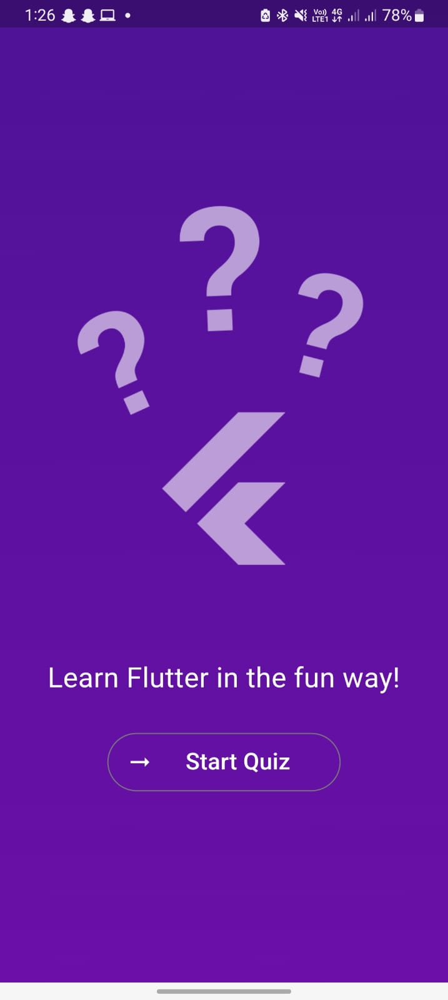
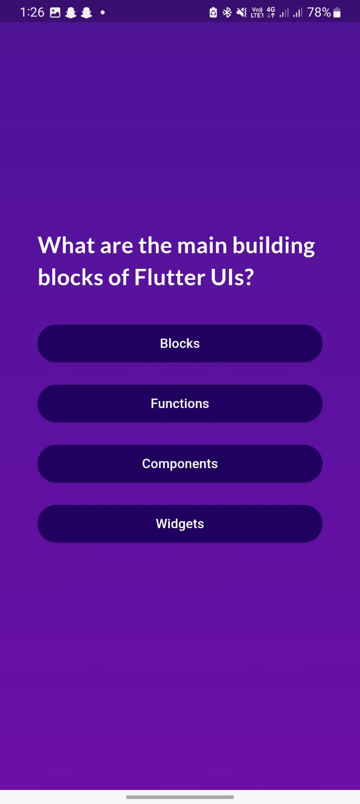
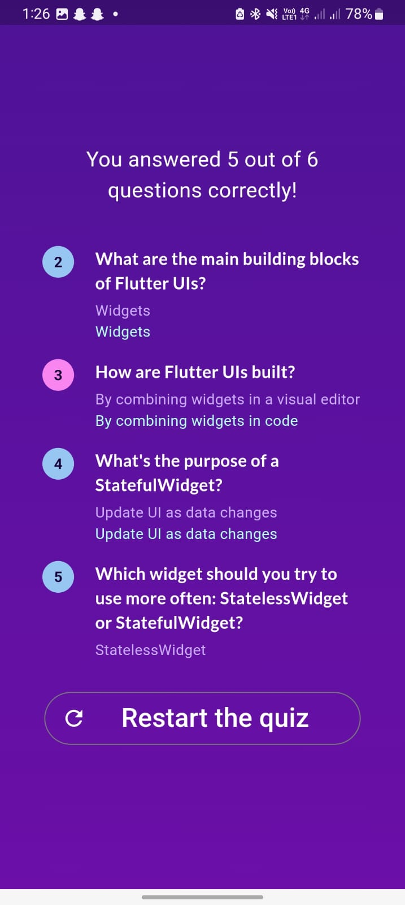

# Flutter Quiz App 📚📝

A fun and interactive quiz app built using Flutter! This app allows users to test their knowledge, get immediate feedback on their answers, and see a summary of their performance at the end. Perfect for anyone looking to learn Flutter while building an engaging quiz application.

## Features 🚀

- **Dynamic Quiz Flow**: Start the quiz, select answers, and receive immediate feedback.
- **Multi-View Experience**: Navigate through different screens (Start, Quiz Questions, Results).
- **Answer Summary**: See which questions you answered correctly and review each answer in the summary screen.
- **Custom Styling**: Unique gradient background and themed buttons for a visually appealing experience.
- **Future Expansion**: Planned updates to add more question categories and improve functionality.

## Screenshots 🖼️

| Start View | Question View | Results View |
|------------|---------------|--------------|
|  |  |  |

## Getting Started 📲

### Prerequisites
- Install [Flutter SDK](https://flutter.dev/docs/get-started/install)
- Set up an editor like [VS Code](https://code.visualstudio.com/) or [Android Studio](https://developer.android.com/studio)

### Installation

1. **Clone this repository**:
   ```bash
   git clone https://github.com/your-username/flutter-quiz-app.git
   cd flutter-quiz-app
### Install dependencies:
    flutter pub get
### Run the app:
    flutter run
## Project Structure 🏗️

- **`main.dart`**: Entry point of the application.
- **`Quiz`**: The main widget that manages quiz state and navigation.
- **`views/`**: Contains different views (`StartView`, `QuestionView`, `ResultsView`) for each part of the quiz.
- **`widgets/`**: Custom reusable widgets, such as `AnswerButton` and `CustomText`.
- **`data/`**: Stores the questions and answers in a structured format.
- **`question_summary/`**: Manages the summary view and provides feedback for each question.


## How It Works 🔍

- **Start the Quiz**: Begin on the `StartView` screen, displaying a welcome message and a start button.
- **Answer Questions**: Navigate through questions, selecting answers using custom answer buttons.
- **View Results**: After completing the quiz, review your performance and restart if you want to try again.


## Planned Updates 🛠️

- **More Question Categories**: Expand the app with additional categories.
- **Enhanced Feedback**: Add explanations for each answer in the results view.
- **Score Tracking**: Save scores locally for users to track progress over time.

## Contributing 🤝

Feel free to fork this repository and submit pull requests. Whether it's bug fixes, new features, or performance improvements, contributions are always welcome!
